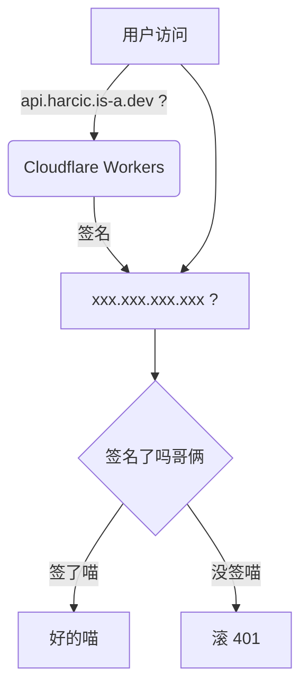

> #### 摘要
> 
> 记录一次从零开始搭建个人云服务的经历，涵盖 Cloudflare Workers、DNS、GitHub Pages、Nginx、阿里云服务器与 Tailscale 的配置，以及其中遇到的各种问题与踩坑。本文也分享了服务器访问安全、SSH 防护和代理配置等实践。

# 前言

也就是昨天（还是前天），念及自己即将开启苦逼的高三一年，自己的 QQBot ，自己的什么什么，就这么再起不能， 似乎有些许的绝望。碰巧在阿里云看见一台
68cny/y 的 *轻量应用服务器* ，2c2g，当然是说不上好的， 但是于我而言他是足够的，所以还是租下了他，为避免浪费服务资源，我也决定稍微做点简单的云服务，
于是又拿下了一个首年 1cny 的 .me 域名。

本文主要记录本人设置有关服务所经历和踩坑（中的可共享部分）。

> #### 小小的广告
>
> 如果您也对 QQBot 感兴趣，您不妨看看由本人参与贡献的如下项目：
>
> - [HarcicYang / EulerOneBot](https://github.com/HarcicYang/EulerOneBot)
> - [LagrangeDev / lagrange-python](https://github.com/LagrangeDev/lagrange-python)
> - [HarcicYang / HyperBotCore](https://github.com/HarcicYang/HyperBotCore)
> - [HarcicYang / HypeR_Bot](https://github.com/HarcicYang/HypeR_Bot)

# 初始计划

建立一些简单的服务并利用 Cloudflare Workers 做转发。



您或许可以看出，这个计划问题不是一般的多，不过我很快就要来纠正他们。

# Workers 配置

Workers 配置本身是简单的，尤其是在这个 AI 时代，我们重点说明如下问题。

## 域名选用

> [!NOTE]
> #### 为什么一定需要一个域名？
>
> 对于中国大陆的网络环境， Cloudflare Workers 并不友好，解析往往是失败的，导致在内地对 Workers 的访问不够简易。
> 幸运的是，我们只需要一个自定义域名就可以解决这个问题。

如你所见，我最初计划在我已有的 harcic.is-a.dev 的基础上申请 api.harcic.is-a.dev 的 nested domain. is-a.dev
完全免费，文档齐全，听起来很完美，但是就在我准备去PR的时候：

```terminaloutput
  ✔ proxy › Domains with proxy enabled must have at least one proxy-able record (297ms)
  ✔ proxy › Domains with specific records must not have proxy enabled
  ✘ [fail]: records › All files should have valid records api.harcic.json: CNAME cannot end with .workers.dev
  ✔ records › Root subdomains should have at least one usable record (134ms)
  ✔ json › All files should have valid required and optional fields (2s)
```

啊是的，is-a.dev 不允许 CNAME 指向 Workers.

> [!TIP]
> CNAME 是 DNS 记录的一种，这种记录指向一个域名，例如利用 CANME 记录，我们可以做到：
> ```text
>  harcic.is-a.dev -> harcicyang.github.io -> GitHub Pages
> ```
> 我们还会见到以下常用记录类型：
> - A : 记录 IPv4 的原始 IP 地址
> - AAAA : 记录 IPv6 的原始 IP 地址
> - MX : 指定该域名的邮件的接收服务器
> - 等等
>
> 关于将 is-a.dev 指向 xxx.xxx.workers.dev 为什么被标记为不合法，我会在下文给出解释。

在郁闷了一段时间后，我在阿里云找到了首年仅仅 1cny 的 .me 域名，没有注意续费价格就租下了。 ~~（啊续费是一年135cny）~~

现在，包装我们的 Workers 就是十分简单的了，我们只需要按照 Cloudflare 的要求更换名称服务器就可以让 Cloudflare 管理我们的域名。
然后我们就可以在 Workers 中选择自己的域名，然后设置子域名即可。

## Workers 该怎么代理

最简单的想法：直接把服务器公网 IPv4 地址写进去不就好了？

嗯，我就这么做了，然后得到了一个让人困惑的 code 1003. 查阅资料后发现 Cloudflare Workers 的一项限制： Workers 不允许请求裸露的
IP 地址。

https://developers.cloudflare.com/support/troubleshooting/http-status-codes/cloudflare-1xxx-errors/error-1003/#error-1003-access-denied-direct-ip-access-not-allowed

```markdown
## Error 1003 Access Denied: Direct IP Access Not Allowed

This error indicates that direct access to a Cloudflare IP address is not allowed.

### Common cause

A client or browser directly accesses a [Cloudflare IP address ↗](https://www.cloudflare.com/ips).

### Resolution

Browse to the website domain name in your URL instead of the Cloudflare IP address.

```

最直接的解决方案当然是去搞个域名。但是如果我们不希望现在就用上域名，我们可以使用 [ssilp.io](https://sslip.io)

只需要把 `xxx.xxx.xxx.xxx` 改写为 `xxx.xxx.xxx.xxx.sslip.io` 即可。

### 如果我立刻为我的服务器设置域名呢？

记得 **不要**在对源 IP 的 DNS 记录设置中开启 “代理”，也不要写不存在的 https.

# 服务端配置

本人使用的阿里云轻量应用服务器似乎不太支持安全组设置，于是我们需要通过防火墙来限制只允许 Cloudflare IP 的访问。

这是我使用的自动脚本：

<details>
<summary>点击展开</summary>

```python
#!/usr/bin/env python3
"""把 Cloudflare 官方 IP 段自动同步到 轻量应用服务器(Lighthouse) 防火墙规则。

子命令：
  --print                                    打印当前 CF IPv4 段
  --check --instance-id <id>                 只对比，有差异退出码 2
  --apply --instance-id <id>                 做差量收敛（默认 dry-run）
  --apply --instance-id <id> --no-dry-run    真正执行（cron 用）

依赖（一次性）：ECS 装 aliyun CLI + swas-open 插件 + aliyun configure
  （RAM 子账号 AliyunSWASFullAccess，地域 ap-northeast-2）。
"""

import argparse
import json
import subprocess
import sys
import time
import urllib.request

CF_API = "https://api.cloudflare.com/client/v4/ips"
CF_FALLBACK = "https://www.cloudflare.com/ips-v4"
UA = {"User-Agent": "servicic-cf-ip-sync/1.0"}
DEFAULT_REGION = "ap-northeast-2"
REMARK = "cf-ip-sync"
CHUNK = 10  # 每次 create/delete 调用携带的规则数上限（保守）


def log(msg):
    print(msg)


def fetch_cf_ips():
    """拉取 CF IPv4 段；主 API 失败时回退到静态页。"""
    for url in (CF_API, CF_FALLBACK):
        try:
            req = urllib.request.Request(url, headers=UA)
            with urllib.request.urlopen(req, timeout=30) as r:
                data = json.loads(r.read().decode())
                return set(data["result"]["ipv4_cidrs"])
        except Exception as e:
            log(f"fetch failed ({url}): {e}")
    sys.exit(1)


def run_aliyun(args):
    """执行 aliyun CLI；失败即退出。打印实际命令方便排查/复核。"""
    cmd = ["aliyun"] + args
    log("$ " + " ".join(cmd))
    p = subprocess.run(cmd, capture_output=True, text=True)
    if p.returncode != 0:
        sys.stderr.write(p.stderr)
        sys.exit(1)
    if not p.stdout.strip():
        return None
    return json.loads(p.stdout)


def list_rules(instance_id, region):
    """列出实例全部防火墙规则，返回 [{port, source, remark, rule_id}]。

    字段以实际 API 响应为准：RuleId（注意不是 FirewallRuleId）。
    若一条规则都解析不到，dump 原始响应前 500 字符到 stderr 供自诊断。
    """
    data = run_aliyun([
        "swas-open", "list-firewall-rules",
        "--instance-id", instance_id,
        "--biz-region-id", region,
        "--page-size", "100",
    ]) or {}

    rules = []

    def walk(x):
        if isinstance(x, dict):
            rid = x.get("RuleId") or x.get("FirewallRuleId")
            if rid:
                rules.append({
                    "rule_id": str(rid),
                    "port": str(x.get("Port") or ""),
                    "source": str(x.get("SourceCidrIp") or ""),
                    "remark": str(x.get("Remark") or ""),
                })
            for v in x.values():
                walk(v)
        elif isinstance(x, list):
            for item in x:
                walk(item)

    walk(data)

    if not rules and data:
        sys.stderr.write("DEBUG: no firewall rules parsed; raw response head:\n"
                         + json.dumps(data)[:500] + "\n")
    return rules


def main():
    ap = argparse.ArgumentParser(description="Sync Cloudflare IP ranges into Lighthouse firewall rules")
    ap.add_argument("--print", action="store_true", help="print current CF IPv4 CIDRs")
    ap.add_argument("--check", action="store_true", help="compare only; exit 2 if drift")
    ap.add_argument("--apply", action="store_true", help="apply drift (dry-run unless --no-dry-run)")
    ap.add_argument("--no-dry-run", action="store_true", help="really apply")
    ap.add_argument("--instance-id", default=None, help="轻量应用服务器实例ID")
    ap.add_argument("--ports", default="80,8080", help="受管端口，逗号分隔")
    ap.add_argument("--region", default=DEFAULT_REGION)
    args = ap.parse_args()

    want = fetch_cf_ips()

    if args.print:
        for c in sorted(want):
            print(c)
        return

    if not args.instance_id:
        sys.stderr.write("--instance-id is required (except --print)\n")
        sys.exit(1)

    ports = [p.strip() for p in args.ports.split(",") if p.strip()]
    rules = list_rules(args.instance_id, args.region)

    # 只关心我们标记过的规则（其余一概不动）
    by_key = {(r["port"], r["source"]): r["rule_id"]
              for r in rules
              if r["remark"] == REMARK and r["port"] in ports}

    desired = {(p, c) for p in ports for c in want}
    adds = sorted(desired - set(by_key))
    removes = [by_key[k] for k in sorted(set(by_key) - desired)]

    if not adds and not removes:
        log("no drift")
        return

    log(f"drift: +{len(adds)} add, -{len(removes)} remove")
    if args.check:
        sys.exit(2)

    def create_args(chunk):
        out = ["swas-open", "create-firewall-rules",
               "--instance-id", args.instance_id, "--biz-region-id", args.region]
        for port, cidr in chunk:
            out += ["--firewall-rules", f"Port={port}", f"Remark={REMARK}",
                    "RuleProtocol=TCP", f"SourceCidrIp={cidr}"]
        return out

    def delete_args(chunk):
        return ["swas-open", "delete-firewall-rules",
                "--instance-id", args.instance_id, "--biz-region-id", args.region,
                "--rule-ids"] + chunk

    if not args.no_dry_run:
        log("dry-run：加 --no-dry-run 才会真正执行，实际命令如下：")
        for i in range(0, len(adds), CHUNK):
            log("$ " + " ".join(create_args(adds[i:i + CHUNK])))
        for i in range(0, len(removes), CHUNK):
            log("$ " + " ".join(delete_args(removes[i:i + CHUNK])))
        return

    for i in range(0, len(adds), CHUNK):
        run_aliyun(create_args(adds[i:i + CHUNK]))
    for i in range(0, len(removes), CHUNK):
        run_aliyun(delete_args(removes[i:i + CHUNK]))

    # 复查收敛
    time.sleep(2)
    rules2 = list_rules(args.instance_id, args.region)
    managed2 = {(r["port"], r["source"]) for r in rules2
                if r["remark"] == REMARK and r["port"] in ports}
    missing = sorted(desired - managed2)
    log("done" if not missing else f"warning: still missing {len(missing)} entries")
    if missing:
        sys.exit(3)


if __name__ == "__main__":
    main()

```

</details>

这一脚本需要您配置阿里云的 RAM 账户并设置有关访问权限。

除此之外的 uvicorn 、 nginx 等配置在 AI 的帮助下应该不是困难的或者有明显障碍的， 不过这也确实需要您对于 Linux 的操作有一定的熟悉程度。

# GitHub Pages

这是一项后来新增的计划。

如你所见，我的 GitHub Pages 早就绑定了 harcic.is-a.dev 这个域名，在我购得新的 .me 域名后，我期望通过这个新域名访问我的个人网站。

## 尝试一：粗暴 CNAME

我根据直觉尝试直接在 CF 的控制台设置 CNAME 记录到 harcic.is-a.dev，然后我在访问时得到：

https://developers.cloudflare.com/support/troubleshooting/http-status-codes/cloudflare-1xxx-errors/error-1011/

```markdown
## Error 1011: Access Denied (Hotlinking Denied)

This error indicates that access to the resource is denied due to hotlinking protection.

### Common cause

A request is made for a resource that
uses [Cloudflare hotlink protection](https://developers.cloudflare.com/waf/tools/scrape-shield/hotlink-protection/).

### Resolution

Notify the website owner of the blocking. If you cannot determine how to contact the website owner, lookup contact
information for the domain via the [Whois database ↗](https://lookup.icann.org/). Since the website owner performed the
blocking, Cloudflare support cannot override a customer's security settings.
```

嗯是的， Cloudflare 不允许将 CNAME 解析到被禁止 hotlink 的 Cloudflare 域名。

## 尝试二：还是粗暴 CNAME

我们还记得，在 is-a.dev 中，我们是通过一条 CNAME 记录配合 GitHub Pages 的 custom domain 设置，达成了从 harcic.is-a.dev 到
harcicyang.github.io 的访问。 那么我们能不能用一样的方法让我们的新域名也解析到 harcicyang.github.io 而不影响
harcic.is-a.dev 的访问呢？

答案是不能。 GitHub Pages 对访问的域名有较为严格的要求，如果访问的域名与 Pages settings 中的设置不符，GitHub 将直接返回
404.

## 尝试三：重定向

这是一个值得考虑的方案，我们确实可以做到两个域名最终呈现相同的内容。Cloudflare 中配置流程大致如下：

1. 进入 Domains, 找的需要设置重定向的域名，进入，随后点击页面左侧边栏 DNS, 进入 DNS 记录的设置
2. 为目标访问域名随意设置一个 DNS 记录
3. 在左侧找到并进入 规则 -> 页面规则
4. 点击 创建页面规则，输入/选择：
    - **URL**: 你的目标访问 URL，如 `your.domain.xyz/*`
    - **选取设置**: 转发 URL
    - **选择状态代码**: 301 和 302 均可
    - **输入目标 URL**: 你的目标URL，如 `http(s)://des.domain.xyz/$1`

   注意 **URL** 的 `/*` 后缀，不设置该后缀会导致不重定向全部页面 注意 **输入目标 URL** 的 `/$1` 后缀，不设置会导致重定向到错误的目标
5. 保存页面规则，然后启用

效果：访问新域名将自动重定向到原域名的对应页面。

## 最终方案：代理

重定向方案确实是方便的，但是他显然不能释放我们域名和云服务器的全部潜能（迫真），于是配置 nginx 转发是一个不错的方案了。

这里提供我使用的 nginx 配置文件：
<details>  
<summary>点击展开</summary>

```conf
server {
    listen 80;
    listen [::]:80;
    server_name YOUR_DOMAIN;

    if ($http_x_forwarded_proto = "http") {  # 强制使用 HTTPS
        return 301 https://$host$request_uri;
    }

    location / {
        proxy_pass https://DES_DOMAIN;
        proxy_ssl_server_name on;
        proxy_set_header Host DES_DOMAIN;
        proxy_set_header Referer "https://DES_DOMAIN/";  # 防止 hotlink 问题
        proxy_set_header X-Forwarded-For $proxy_add_x_forwarded_for;
        proxy_set_header X-Forwarded-Proto https;
        proxy_http_version 1.1;
        proxy_read_timeout 30s;
    }
}

```

</details>

这样，我们不仅做到了对两个域名所访问的内容的统一，还让新域名的访问获得了一丝丝的加速（主要体现在中国大陆地区）
~~（玄学警告⚠️）~~。

# 访问安全

我们在 [前文提到的自动化配置脚本](#服务端配置) 中已经将 80 和 8080 都送给了 Cloudflare，但是此时我们仍然有一大安全隐患：
**SSH**.

在阿里云的默认配置中，22 端口允许任意网段的访问，这显然不是十分稳妥。 于是我们我们计划通过某种方式，让我们能够不通过公网访问
SSH，并结束 22 端口在公网中的暴露。

我个人较为认可的方式有二：

- Cloudflare Zero Trust + Cloudflare Tunnel
- Tailscale

由于尚没有可以绑定到 Cloudflare 的支付方式，我 ~~被迫（？）~~ 选择了后者。

## Tailscale 的配置

Tailscale 的配置无非两部分，服务器端和我们手上的的终端。但是由于我们对于科学上网的特殊需要，我将稍微展开叙述。

### Ts: 服务器配置

```bash
curl -fsSL https://tailscale.com/install.sh | sh
sudo tailscale up # 登陆
sudo tailscale set --ssh  # 设置 SSH 访问
```

服务器上的配置基本就是如此。不过我们可能遇到奇奇怪怪的问题，例如：

```terminaloutput
$ git pull
ssh: Could not resolve hostname github.com: Name or service not known
fatal: Could not read from remote repository.

Please make sure you have the correct access rights
and the repository exists.
```

什么？你找不到 github.com ?

通过检查，`cat /etc/resolv.conf` 发现我们的 DNS 被 tailscale 覆写，怀疑 tailnet 对部分地址不能正确解析，于是我们设置 DNS
并刷新缓存：

```bash
resolvectl dns eth0 223.5.5.5 223.6.6.6  # 不要直接写个 eth0 ，根据 `ip -brief link` 判断你实际使用的设备， DNS 也不一定是用阿里的啦～
resolvectl flush-caches
```

问题解决。至此，我们可以转向其他的终端了。

### Ts: iOS / iPadOS 配置

苹果设备的配置原本是极为简单的：我们只需要在 App Store 安装 Tailscale 然后按照要求配置即可。 但是由于我们对于科学上网的需要和
iOS 的平台限制，我们需要寻求一种可以在连接 tailnet 的同时保证科学上网的方式。

#### Shadowrocket

> [!NOTE]
> 这一节内容摘自 [zongyanglaobiao.github.io](https://zongyanglaobiao.github.io/blog/article/shadowrocketandtailscale/) ©
> 2024/08/06 - 2026 J.A

Shadowrocket 在 2.2.90 版本引入了内置的 Tailscale 支持，我们可以非常方便的完成配置。

准备工作：

- Shadowrocket >= 2.2.90
- Tailscale **Auth Key**

操作步骤：

1. 进入 [Tailscale 管理控制台](https://console.tailscale.com/admin/machines)，展开左侧 Settings 选项卡，点击 Key
2. 在 **Auth Key** 一栏（注意不要找错哦）点击 `Generate auth key`，内容按需填写即可，然后保存并记下你的 auth key
3. 来到 Shadowrocket，进入设置，在 隧道 一节找到 Tailscale，在认证密钥一栏输入你的 auth key，然后启用。

完成上述步骤后，我们应当可以通过 Tailscale IP 访问我们的服务器、连接 SSH。

### Ts: Linux 终端

由于本人电脑性能问题，本人几乎一切开发工作都在 Arch Linux 下而不是 Windows 进行，于是前者也成为我的日用系统， 所以这里出现了一份
Linux 介绍而不是 Windows 喵（）

Linux 终端的初始配置和服务端基本相同，略。我们重点关注与代理工具的配合，此处以 Clash Verge 为例。

#### Clash Verge

> [!NOTE]
> 这一节内容基本来自 [jiz4oh.com](https://jiz4oh.com/2024/09/tailscale-with-clash/)，作者 jiz4oh。
> 原文也包含了对 Windows、 macOS、iOS、Android 的教程。

步骤大致如下：

1. 修改 `/etc/default/tailscaled`，使 Tailscale 不再修改 iptables：

```text
# Set the port to listen on for incoming VPN packets.
# Remote nodes will automatically be informed about the new port number,
# but you might want to configure this in order to set external firewall
# settings.
PORT="0"

# Extra flags you might want to pass to tailscaled.
FLAGS="--tun=userspace-networking --socks5-server=0.0.0.0:1099"
```

2. 重启 Tailscale 并设置为 Exit 节点

```bash
sudo systemctl restart tailscaled
sudo tailscale set --advertise-exit-node
```

3. 进入 Clash Verge 配置，添加代理和规则：

```yaml
proxies:
    ...
      - { name:
      tailscale-socks, type:
        socks5, server:
          localhost, port: 1099 }
rules:
  - IP-CIDR,100.64.0.0/10,tailscale-socks
  - IP-CIDR,fd7a:115c:a1e0::/48,tailscale-socks
```

完成上述步骤后，我们应当可以通过 Tailscale IP 访问我们的服务器、连接 SSH。

# 写在最后

初次认真的配置一台服务器，怎么说呢，感觉还挺奇妙啊（

~~喵的 这得有 AI 一半功劳~~

行了，不说了，高考加油喵。加油喵。。。加油。喵。。。。。。
